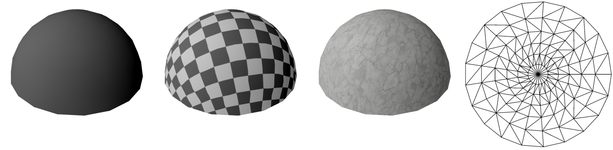
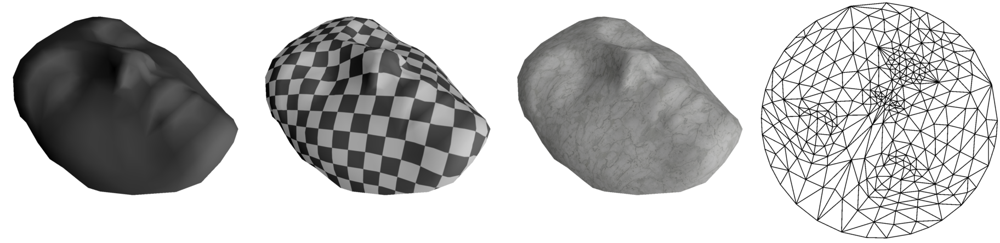
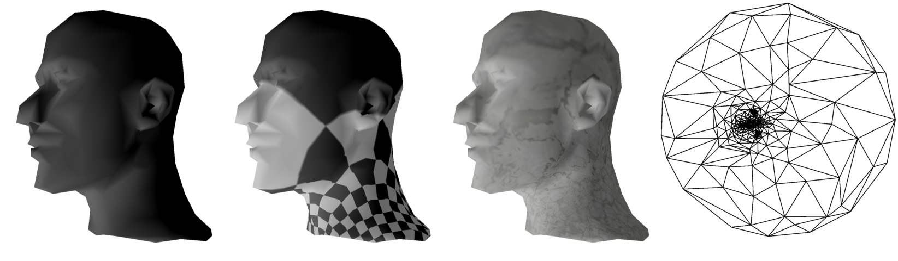
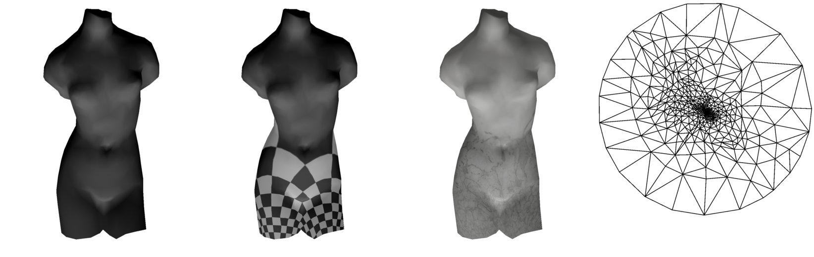

# auto_uv_map - Reference Implementation of Automatic UV mapping with Harmonic Mapping

This is a reference implementation of automatic UV mapping with
harmonic maps. To my knowledge, there does not really exist a readable
reference implementation of harmonic mapping that you can learn
from. This implementation aims to solve that problem. And also, to
provide an implementation of harmonic mapping that is easy to
integrate with other projects.

# Image Gallery

This image gallery shows how the UV-mapper performs on different input
meshes.

### sphere


First image is the mesh without texture, second image is with checker
texture, third image is with marble texture, and the fourth image is a
visualization of the created UV map.

### mask


### head


### venus


### video

[](https://www.youtube.com/watch?v=5Ob5IEohe7s)


## Building and Usage

If on Linux or OS X, you can build it in the terminal by doing:

```
mkdir build && cd build && cmake .. && make
```

You can then supply a mesh to be UV-mapped, and optionally a custom
texture by doing

```
./auto_uv --texture=../custom_texture.png ../sphere.obj
```

and then the app will launch, and show you the UV-mapped mesh. You can
download some meshes to test the program with
[here](https://www.ceremade.dauphine.fr/~peyre/teaching/manifold/tp4.html). But
make sure to only feed `.obj` files to the program.

If on Windows, create a `build/` folder, and run `cmake ..` from
inside that folder. This will create a visual studio solution(if you
have visual studio). Launch that solution, and then simply compile the
project.

## Limitations

Harmonic mapping works by first fixing the UV coordinates of the
boundary vertices onto a circle, and then finding the UV coordinates
of the remaining vertices by solving a linear system. As a result of
this, the approach only works on meshes that are *topological disks*.

A topological disk is basically a mesh that has *one* clearly defined
boundary. The mask seen in the images above is a topological disk,
because it has one clear boundary, consisting of boundary
edges. But a closed sphere is not a topological disk, because it
has no boundary. In order to UV map objects that are non-topological
disks, you would have to cut the mesh into pieces that are topological
disks, and then perform harmonic mapping on those disks. However,
cutting a mesh into pieces in a way that results in a nice UV map is
in itself a rather difficult problem. To keep things simple, this
implementation does no cutting, and therefore only supports
topological disks.

Finally, just because a mesh is a topological disk, that does not mean
that Harmonic Mapping always yields a good UV map. As can be seen in
the head-mesh above, it performs pretty terribly for certain
meshes. But if you cut those meshes into smaller pieces, and do
harmonic mapping on those pieces, it can perform pretty well.

## Code Roadmap

The UV-mapping code is in the directory `src/uv_mapper/`. And you can
see the main algorithm in `src/uv_mapper/uv_mapper.cpp`. Note that the
only dependency of the UV-mapper is Eigen and STL, so it should be
easy to integrate into other projects.

## How does all this work!?

Unfortunately, if you don't understand the underlying math, it is a
bit difficult to grasp how the UV-mapper code actually works. For this
reason, I am currently working on writing an article that explains the
underlying math. Until it is done, please be patient.

## References

The following documents were consulted when implementing the
UV-mapper:

- http://graphics.stanford.edu/courses/cs468-10-fall/LectureSlides/12_Parameterization1.pdf
- [Harmonic Map Tutorial with C++ Source](http://www3.cs.stonybrook.edu/~gu/tutorial/HarmonicMap.html)
- [Mesh Parameterization: Theory and Practice](http://alice.loria.fr/publications/papers/2007/SigCourseParam/param-course.pdf)
- [Multiresolution analysis of arbitrary meshes](hhoppe.com/mra.pdf)
